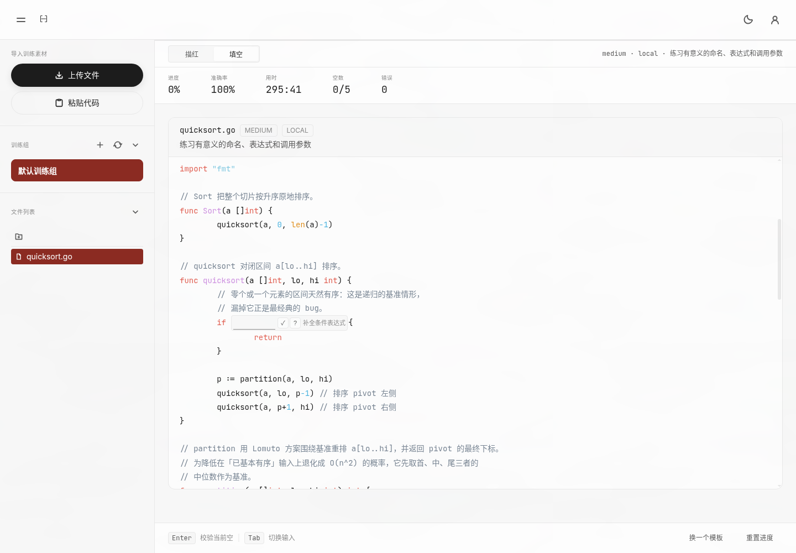
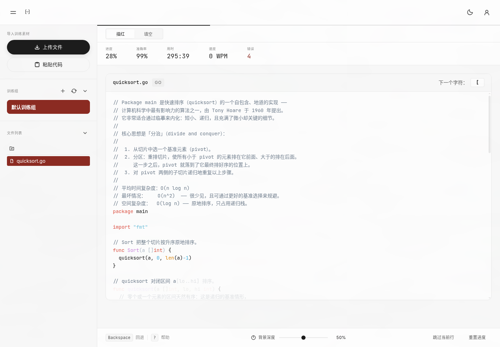
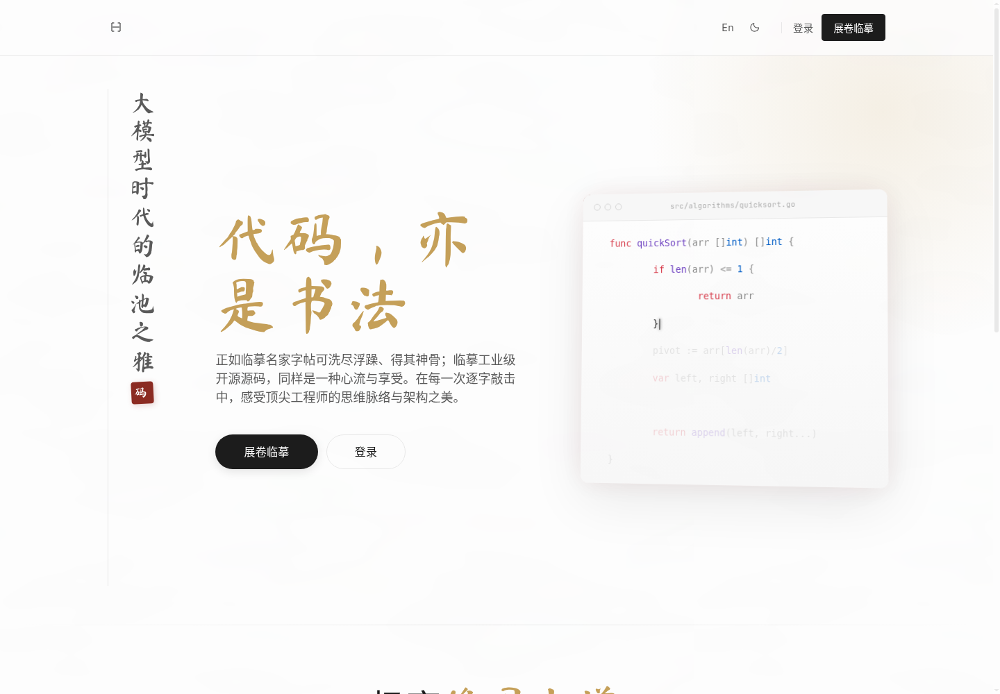
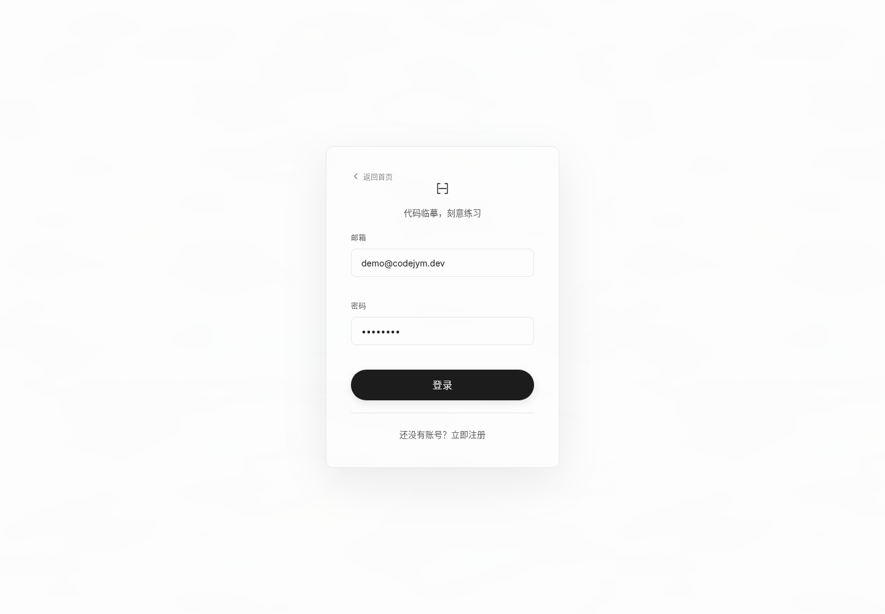

# CodeJYM

<div align="center">
  

  <p><strong>A code practice studio for deliberate source-code memorization.</strong></p>

  <p>
    
    
    
    
    
  </p>

  <p>
    <a href="#quick-start">Quick Start</a> ·
    <a href="#screenshots">Screenshots</a> ·
    <a href="#highlights">Highlights</a> ·
    <a href="#architecture">Architecture</a> ·
    <a href="#documentation">Docs</a>
  </p>
</div>

<p align="center">
  
</p>

## Screenshots

<table>
  <tr>
    <td width="50%">
      <strong>Tracing Practice</strong><br>
      
    </td>
    <td width="50%">
      <strong>Fill-in Practice</strong><br>
      
    </td>
  </tr>
  <tr>
    <td width="50%">
      <strong>Landing</strong><br>
      
    </td>
    <td width="50%">
      <strong>Authentication</strong><br>
      
    </td>
  </tr>
</table>

## What Is CodeJYM?

CodeJYM helps learners rehearse real source files with practice modes designed for memorization, recall, and deliberate repetition.

- **Tracing Practice**: reproduce a source file character by character with saved progress, timing, and error tracking.
- **Fill-in Practice**: restore meaningful hidden code spans from reusable templates generated by a model provider or the local fallback generator.

## Highlights

| Area | What CodeJYM provides |
| --- | --- |
| Practice modes | Trace source files exactly, intentionally skip lines, reset sessions, and resume from the saved cursor. |
| Fill-in templates | Generate 3-5 semantically valuable blanks per template, reject trivial blanks, and cap reusable templates per source file version. |
| Model providers | DeepSeek by default, with OpenAI-compatible/GPT and Anthropic/Claude options. User keys are encrypted server-side. |
| Language coverage | Go, Rust, TypeScript, JavaScript, Python, Java, C/C++, C#, Ruby, PHP, Swift, Kotlin, shell, YAML, JSON, Markdown, TOML, and plain text. |
| Source management | Upload ZIP files, upload single files, paste snippets, organize folders, rename/move/delete files, and use local or S3-compatible object storage. |
| Persistence | PostgreSQL stores users, assets, practice sessions, fill-in templates, fill-in attempts, and model configuration. Redis can buffer high-volume progress writes. |
| Deployment | Docker Compose profiles cover local single-instance deployment, proxy deployment, and scaled local multi-replica testing. |

## Quick Start

Start the complete local stack:

```sh
PORT=8080 POSTGRES_PORT=5432 docker compose -p codejym -f config/docker-compose.yml up -d --build
```

Open:

```text
http://127.0.0.1:8080
```

Default demo account:

```text
demo@codejym.dev / demo1234
```

Stop the stack:

```sh
docker compose -p codejym -f config/docker-compose.yml down
```

## Local Development

Backend:

```sh
cd backend
go test ./...
go vet ./...
go run ./cmd/server -addr :8080
```

Frontend:

```sh
cd frontend
npm ci
npm run dev
```

The production Docker image builds the Vue frontend first, then embeds the static files into the Go server image.

## Local Checks

Run the main local gate:

```sh
make test
```

Available targets:

| Command | Scope |
| --- | --- |
| `make test-backend` | Go formatting check, unit tests, and `go vet`. |
| `make test-frontend` | Vitest, production build/typecheck, and ESLint. |
| `make test` | Backend and frontend gates. |
| `make smoke` | Build the Docker Compose stack, wait for health, run API smoke tests, then tear it down. |
| `make deploy-local` | Build and keep a local stack running for browser testing. |

The smoke test creates a temporary user, enters fill-in practice for the default Go asset, verifies answer/reveal/reset behavior, pastes a Rust file, and verifies Rust fill-in generation.

## Model Configuration

Model-assisted fill-in generation is optional. Without a key, CodeJYM falls back to a deterministic local generator.

Server-side environment variables:

```sh
MODEL_CONFIG_SECRET=change-me
DEEPSEEK_API_KEY=
OPENAI_API_KEY=
ANTHROPIC_API_KEY=
```

Rules:

- Do not commit real provider keys.
- Use `.env` or deployment secrets for development/default keys.
- User-provided keys are submitted to the backend and encrypted before storage.
- The frontend only receives masked key metadata.

## Architecture

```text
Browser
  |
  v
Go HTTP server
  |-- Vue static frontend
  |-- REST API
  |-- PostgreSQL: users, assets, sessions, fill-in templates, answers
  |-- Redis: optional progress write-back buffer
  |-- File storage: local filesystem or S3-compatible object storage
```

## Repository Layout

```text
backend/   Go API server and storage layer
frontend/  Vue 3 + TypeScript application
config/    Dockerfile and Compose deployment files
scripts/   Local test, deploy, backup, and migration utilities
tests/     Load-test assets
docs/      Design notes, ADRs, deployment docs, bug analyses
```

## Documentation

- [Project context](CONTEXT.md)
- [Fill-in practice design](docs/design/fill-in-practice.md)
- [Architecture decisions](docs/adr/)
- [Deployment docs](docs/deployment/README_DEPLOYMENT.md)
- [Security configuration](docs/security/SECURITY_CONFIGURATION.md)
- [Load testing](tests/load/README.md)

## License

MIT License.
